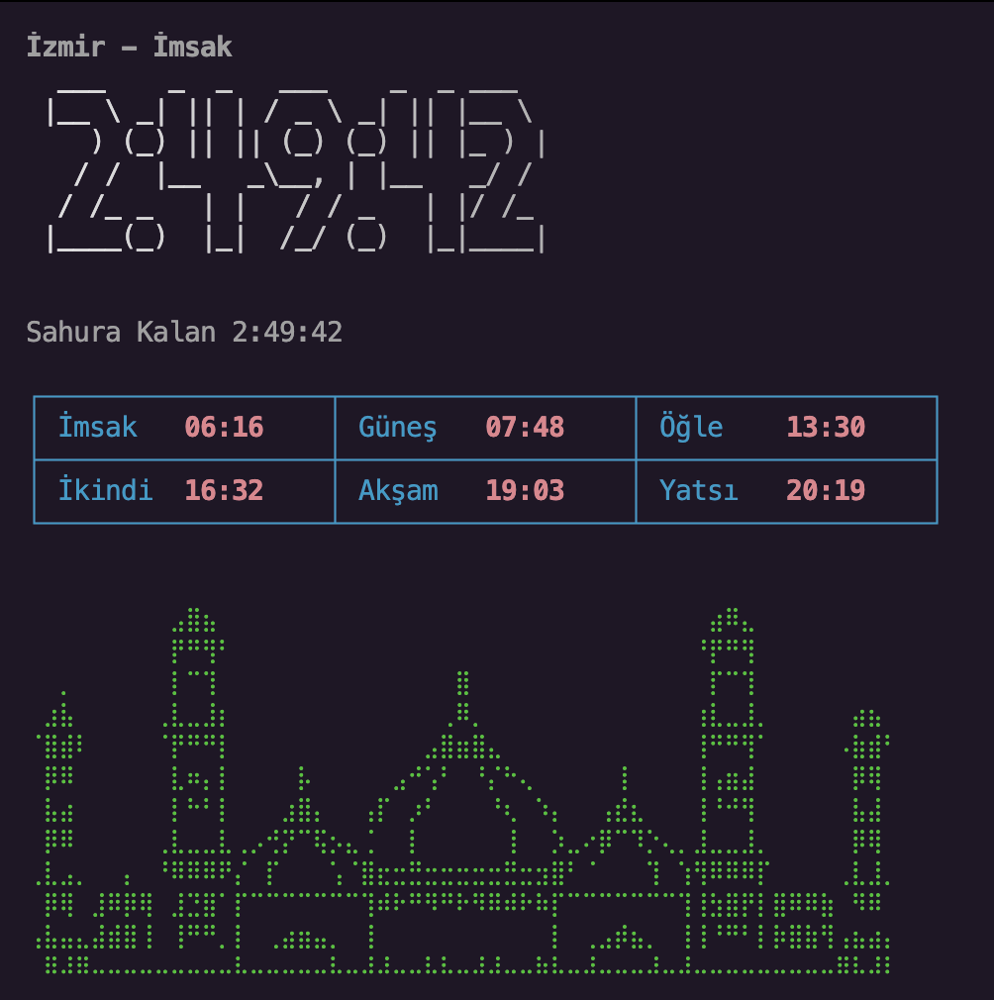

# Namaz CLI 🌙

Terminal ekranından, şık bir tasarımla Günlük Ezan Vakitlerini ve İftar/Sahur geri sayımını takip edebileceğiniz bir Node.js CLI aracıdır.

Pır pır etmeyen (flicker-free) akıcı animasyonu, büyük saat fontları ve ASCII sanatı ile terminalinize estetik bir dokunuş katar. Özellikle Ramazan ayında "Sahura Kalan" ve "İftara Kalan" süreleri otomatik olarak hesaplar.

## Özellikler

- **İlk Kurulum Sihirbazı:** İlk çalıştırıldığında bulunduğunuz ülke ve şehri sorar ve kaydeder (değiştirmek için `--reset` kullanabilirsiniz).
- **Canlı Geri Sayım:** Sahura, İftara (Ramazan'da) veya bir sonraki vakte kalan süreyi saniye saniye akıcı bir şekilde gösterir.
- **Diyanet Uyumlu Veri:** `aladhan.com` API'si üzerinden Diyanet İşleri Başkanlığı'nın hesaplamalarını (Method 13) baz alır.
- **Ramazan Modu:** Güncel hicri aya göre (9. ay Ramazan) sahur ve iftar etiketlerine tam uyumlu çalışır. Gece saatlerinde doğrudan doğru güne sahur atamasını yapar.
- **Şık Tasarım:** 
  - `figlet` ve `gradient-string` ile yazılmış büyük renkli fontlar.
  - `cli-table3` ile muntazam ve hizalanmış vakit çizelgesi tablosu.
  - `log-update` ile ekran dalgalanması yapmayan pürüzsüz animasyonlar.
  - Yeşil detaylarla süslenmiş büyük özel ASCII cami figürü.
- **Hicri Takvim Çevirisi:** Bulunduğunuz güne ait çevrilmiş Türkçe hicri ay ve gün bilgisi sağlar.



## Kurulum ve Kullanım

Proje `package.json` üzerinden CLI komutu olarak ayarlanmıştır. Çalıştırmak için şu adımları izleyebilirsiniz:

### 1. Klonlama ve Yüklme
```bash
# Projeyi bilgisayarınıza indirin
git clone https://github.com/tamert/namaz-cli.git
cd namaz-cli

# Bağımlılıkları yükleyin
npm install
```

### 2. Çalıştırma
Projeyi global kurulum yapmadan test etmek isterseniz:
```bash
node index.js
```

Terminalinizde her yerden komut olarak çalıştırabilmek için global (link) bağlantısı verebilirsiniz:
```bash
# Klasör içindeyken terminale global bir komut eklemek için
npm link
```

# Artık her yerden bu komutla çalıştırabilirsiniz:
```bash
namaz
```

## Ayarları Değiştirme
Yanlış bir ülke/şehir girdiyseniz veya konumunuzu değiştirdiyseniz ayarları sıfırlamak için `--reset` bayrağını kullanabilirsiniz:

```bash
namaz --reset
```

## Bağımlılıklar (Teşekkürler!)

Bu projenin oluşmasını sağlayan modüller:
- [axios](https://www.npmjs.com/package/axios) - API İstekleri
- [chalk](https://www.npmjs.com/package/chalk) - Renklendirmeler
- [figlet](https://www.npmjs.com/package/figlet) - ASCII Rakam Fontları
- [gradient-string](https://www.npmjs.com/package/gradient-string) - Geçişli Renkler
- [cli-table3](https://www.npmjs.com/package/cli-table3) - Tablo Çizimleri
- [date-fns](https://www.npmjs.com/package/date-fns) - Hata payı barındırmayan Date hesaplamaları
- [log-update](https://www.npmjs.com/package/log-update) - Akıcı terminal refresh yapısı

## Lisans
ISC
